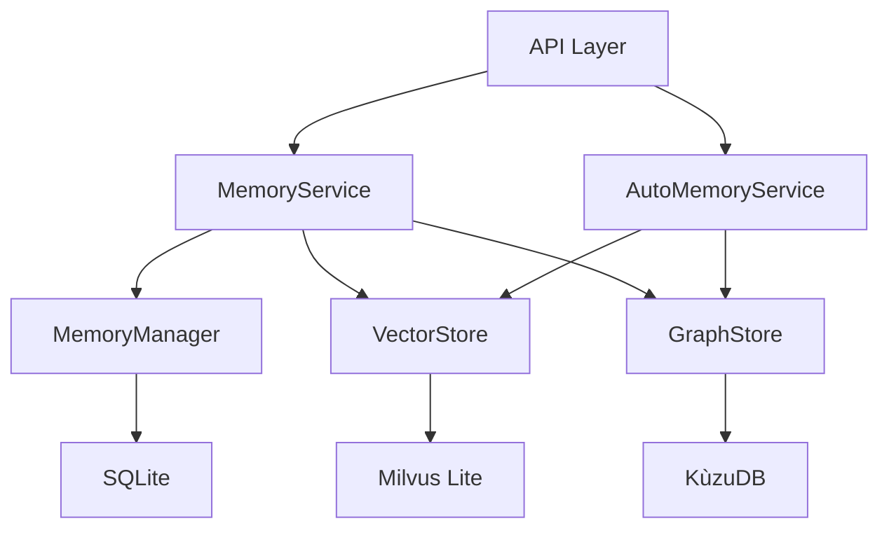

# 数据库处理代码审计报告

> 审计日期: 2026-02-05
> 审计范围: SQLite、Milvus Lite、KùzuDB 相关代码

## 一、总体架构概览

该项目使用三种数据库技术：
- **SQLite** ([`backend/models/database.py`](../backend/models/database.py)) - 存储元数据和关系数据
- **Milvus Lite** ([`backend/memory/vector_store.py`](../backend/memory/vector_store.py)) - 向量存储和检索
- **KùzuDB** ([`backend/memory/graph_store.py`](../backend/memory/graph_store.py)) - 图数据库存储实体关系



---

## 二、严重安全问题

### 1. SQL注入漏洞 🔴 严重

**位置**: [`backend/memory/graph_store.py`](../backend/memory/graph_store.py)

所有SQL查询使用f-string直接拼接，存在SQL注入风险：

| 方法 | 行号 | 问题 |
|------|------|------|
| `create_entity()` | 140-147 | 直接拼接name、type、description |
| `create_user()` | 172-175 | 直接拼接id、name |
| `create_concept()` | 202-207 | 直接拼接name、description |
| `create_relation()` | 239-253 | 直接拼接from_entity、to_entity |
| `create_mentions()` | 280-285 | 直接拼接user_id、entity_name |
| `query_entity()` | 311-315 | 直接拼接entity_name |
| `update_entity_access()` | 384-387 | 直接拼接entity_name |

**影响**: 攻击者可以通过构造恶意输入执行任意SQL语句，可能导致数据泄露、数据篡改或数据库被破坏。

**修复建议**:

```python
# 使用参数化查询
async def create_entity(self, name: str, type: str, description: Optional[str] = None) -> bool:
    current_time = get_current_timestamp_ms()
    
    try:
        # 使用KùzuDB的参数化查询语法
        self.conn.execute(
            f"MERGE (e:{settings.KUZU_NODE_TABLE_ENTITY} {{name: $name}}) "
            "ON CREATE SET e.type = $type, e.description = $description, "
            "e.created_at = $created_at, e.last_accessed_at = $last_accessed_at",
            {
                "name": name,
                "type": type,
                "description": description or "",
                "created_at": current_time,
                "last_accessed_at": current_time
            }
        )
        
        logger.debug(f"Created entity: name={name}, type={type}")
        return True
        
    except Exception as e:
        logger.error(f"Failed to create entity: {e}")
        return False

# 或者添加输入验证和转义
def _escape_string(value: str) -> str:
    """转义字符串以防止SQL注入"""
    return value.replace("'", "''").replace("\\", "\\\\")
```

---

## 三、资源管理问题

### 2. 数据库连接未正确关闭 🟠 高

**位置**: 
- [`backend/memory/memory_manager.py:19-22`](../backend/memory/memory_manager.py:19-22)
- [`backend/services/memory_service.py:24-27`](../backend/services/memory_service.py:24-27)

```python
class MemoryManager:
    def __init__(self):
        """初始化记忆管理器"""
        self.db = SessionLocal()  # 创建会话但没有明确的关闭机制
        logger.info("MemoryManager initialized")
```

**影响**: 可能导致连接泄漏，特别是在异常情况下。长时间运行后可能耗尽数据库连接池资源。

**修复建议**:

```python
# 方案1: 使用依赖注入模式（推荐）
from fastapi import Depends
from sqlalchemy.orm import Session

def get_db():
    """数据库会话依赖"""
    db = SessionLocal()
    try:
        yield db
    finally:
        db.close()

class MemoryManager:
    def __init__(self, db: Session = Depends(get_db)):
        """初始化记忆管理器"""
        self.db = db
        logger.info("MemoryManager initialized")

# 方案2: 实现上下文管理器
from contextlib import contextmanager

@contextmanager
def get_memory_manager():
    """获取记忆管理器的上下文管理器"""
    db = SessionLocal()
    try:
        manager = MemoryManager()
        manager.db = db
        yield manager
    finally:
        db.close()
        logger.info("MemoryManager closed")

# 使用示例
async with get_memory_manager() as manager:
    memory = await manager.create_memory(...)
```

### 3. 临时会话可能未正确关闭 🟠 高

**位置**: [`backend/memory/retrieval.py:248-273`](../backend/memory/retrieval.py:248-273)

```python
async def _enrich_with_event_time(self, results: List[Dict[str, Any]]):
    try:
        from models.database import SessionLocal, Memory
        db = SessionLocal()
        
        try:
            # 查询逻辑
            memories = db.query(Memory).filter(Memory.vector_id.in_(vector_ids)).all()
            # ...
        finally:
            db.close()  # 在finally中关闭，这是好的做法
```

**影响**: 虽然使用了try-finally，但如果在查询过程中发生异常，可能仍有资源泄漏风险。

**修复建议**: 当前实现已经较好，但可以进一步改进：

```python
async def _enrich_with_event_time(self, results: List[Dict[str, Any]]) -> List[Dict[str, Any]]:
    """从数据库中获取event_time信息并添加到结果中"""
    try:
        vector_ids = [result.get("id") for result in results]
        
        if not vector_ids:
            return results
        
        from models.database import SessionLocal, Memory
        
        # 使用上下文管理器确保连接关闭
        with SessionLocal() as db:
            try:
                memories = db.query(Memory).filter(
                    Memory.vector_id.in_(vector_ids)
                ).all()
                
                event_time_map = {}
                for memory in memories:
                    event_time = getattr(memory, 'event_time', None)
                    if event_time is not None:
                        event_time_map[memory.vector_id] = event_time.isoformat()
                
                for result in results:
                    vector_id = result.get("id")
                    result["event_time"] = event_time_map.get(vector_id)
                
                logger.debug(f"Enriched {len(event_time_map)} results with event_time")
                
            except Exception as e:
                logger.warning(f"Failed to enrich results with event_time: {e}")
        
        return results
        
    except Exception as e:
        logger.warning(f"Failed to enrich results with event_time: {e}")
        return results
```

### 4. 事务管理不一致 🟠 高

**位置**: [`backend/services/memory_service.py:170`](../backend/services/memory_service.py:170)

```python
async def update_memory(self, memory_id: str, memory_data: MemoryUpdate) -> Optional[Memory]:
    try:
        # ... 更新逻辑 ...
        
        self.db.commit()  # 直接提交，没有try-finally保护
        self.db.refresh(memory)
        
        return memory
        
    except Exception as e:
        self.db.rollback()  # 异常时回滚
        logger.error(f"Failed to update memory: {e}")
        return None
```

**影响**: 如果在commit之后、refresh之前发生异常，数据库状态可能不一致。

**修复建议**:

```python
async def update_memory(self, memory_id: str, memory_data: MemoryUpdate) -> Optional[Memory]:
    try:
        memory = await memory_manager.get_memory(memory_id)
        if not memory:
            return None

        # 更新内容
        if memory_data.content is not None:
            embedding = await embedding_client.embed(memory_data.content)

            await vector_store.update_vector(
                id=memory.vector_id,
                content=memory_data.content,
                embedding=embedding
            )

            memory.content = memory_data.content

            from utils.helpers import calculate_similarity_score, get_current_timestamp_ms
            new_score = calculate_similarity_score(
                similarity=1.0,
                access_count=memory.access_count,
                max_access_count=100,
                last_accessed_at=get_current_timestamp_ms(),
                created_at=int(memory.created_at.timestamp() * 1000),
                lambda_decay=0.0001,
                graph_score=0.0
            )
            memory.score = new_score

        if memory_data.metadata is not None:
            memory.set_metadata(memory_data.metadata)

        # 使用try-finally确保事务正确处理
        try:
            self.db.commit()
            self.db.refresh(memory)
        except Exception as commit_error:
            self.db.rollback()
            raise commit_error

        logger.info(f"Updated memory: id={memory_id}, score={memory.score}")
        return memory

    except Exception as e:
        self.db.rollback()
        logger.error(f"Failed to update memory: {e}")
        return None
```

---

## 四、数据一致性问题

### 5. 跨数据库操作缺乏事务保护 🟠 高

**位置**: [`backend/services/memory_service.py:29-99`](../backend/services/memory_service.py:29-99)

```python
async def create_memory(self, memory_data: MemoryCreate, content: str, event_time: Optional[datetime] = None):
    try:
        # 1. 将内容转换为向量
        embedding = await embedding_client.embed(content)

        # 2. 插入向量存储
        vector_id = generate_id()
        success = await vector_store.insert_knowledge(
            id=vector_id,
            persona_id=memory_data.persona_id,
            content=content,
            embedding=embedding,
            entity_id=memory_data.entity_id,
            metadata=memory_data.metadata
        )

        # 3. 如果有实体ID，创建或更新图谱节点
        if memory_data.entity_id:
            await graph_store.create_entity(
                name=memory_data.entity_id,
                type="default",
                description=content[:200]
            )

            # 提取并创建实体关系
            entities = extract_entities(content)
            for entity in entities:
                if entity != memory_data.entity_id:
                    await graph_store.create_relation(
                        from_entity=memory_data.entity_id,
                        to_entity=entity,
                        relation_type="RELATED_TO",
                        weight=1.0
                    )

        if not success:
            raise Exception("Failed to insert vector")

        # 4. 创建记忆记录
        memory = await memory_manager.create_memory(
            vector_id=vector_id,
            persona_id=memory_data.persona_id,
            content=content,
            type=memory_data.type,
            entity_id=memory_data.entity_id,
            metadata=memory_data.metadata,
            event_time=event_time
        )

        return memory
    except Exception as e:
        logger.error(f"Failed to create memory: {e}")
        return None
```

**影响**: 
- 如果第3步（图谱操作）失败，第2步（向量存储）的数据已经写入但无法回滚
- 如果第4步（SQLite）失败，向量存储和图谱数据都会成为孤立数据
- 数据不一致可能导致检索结果不准确

**修复建议**:

```python
async def create_memory(
    self,
    memory_data: MemoryCreate,
    content: str,
    event_time: Optional[datetime] = None
) -> Optional[Memory]:
    """
    创建记忆（带事务保护）
    """
    embedding = None
    vector_id = None
    memory = None
    
    try:
        # 1. 将内容转换为向量
        embedding = await embedding_client.embed(content)
        
        # 2. 插入向量存储
        vector_id = generate_id()
        success = await vector_store.insert_knowledge(
            id=vector_id,
            persona_id=memory_data.persona_id,
            content=content,
            embedding=embedding,
            entity_id=memory_data.entity_id,
            metadata=memory_data.metadata
        )
        
        if not success:
            raise Exception("Failed to insert vector")
        
        # 3. 创建图谱节点和关系
        if memory_data.entity_id:
            await graph_store.create_entity(
                name=memory_data.entity_id,
                type="default",
                description=content[:200]
            )
            
            entities = extract_entities(content)
            for entity in entities:
                if entity != memory_data.entity_id:
                    await graph_store.create_relation(
                        from_entity=memory_data.entity_id,
                        to_entity=entity,
                        relation_type="RELATED_TO",
                        weight=1.0
                    )
        
        # 4. 创建记忆记录
        memory = await memory_manager.create_memory(
            vector_id=vector_id,
            persona_id=memory_data.persona_id,
            content=content,
            type=memory_data.type,
            entity_id=memory_data.entity_id,
            metadata=memory_data.metadata,
            event_time=event_time
        )
        
        if not memory:
            raise Exception("Failed to create memory record")
        
        logger.info(f"Created memory: id={memory.id}, type={memory_data.type}")
        return memory
        
    except Exception as e:
        # 回滚已执行的操作
        logger.error(f"Failed to create memory, rolling back: {e}")
        
        # 回滚向量存储
        if vector_id:
            try:
                await vector_store.delete_vector(vector_id)
                logger.info(f"Rolled back vector: {vector_id}")
            except Exception as rollback_error:
                logger.error(f"Failed to rollback vector: {rollback_error}")
        
        # 回滚图谱数据（如果需要）
        if memory_data.entity_id:
            try:
                # KùzuDB可能不支持删除，这里需要根据实际情况处理
                logger.warning(f"Graph data rollback not implemented for entity: {memory_data.entity_id}")
            except Exception as rollback_error:
                logger.error(f"Failed to rollback graph data: {rollback_error}")
        
        return None
```

### 6. 删除操作数据不同步 🟡 中

**位置**: [`backend/services/memory_service.py:181-208`](../backend/services/memory_service.py:181-208)

```python
async def delete_memory(self, memory_id: str) -> bool:
    try:
        # 获取记忆
        memory = await memory_manager.get_memory(memory_id)
        if not memory:
            return False

        # 删除向量存储中的数据
        await vector_store.delete_vector(memory.vector_id)

        # 删除记忆记录
        success = await memory_manager.delete_memory(memory_id)

        logger.info(f"Deleted memory: id={memory_id}, success={success}")
        return success

    except Exception as e:
        logger.error(f"Failed to delete memory: {e}")
        return False
```

**影响**: 
- 如果向量删除成功但数据库删除失败，数据不一致
- 图谱中的实体和关系没有被删除，导致孤立数据

**修复建议**:

```python
async def delete_memory(self, memory_id: str) -> bool:
    """
    删除记忆（带完整清理）
    """
    try:
        # 获取记忆
        memory = await memory_manager.get_memory(memory_id)
        if not memory:
            return False

        vector_id = memory.vector_id
        entity_id = memory.entity_id
        
        # 1. 删除向量存储中的数据
        vector_deleted = await vector_store.delete_vector(vector_id)
        if not vector_deleted:
            logger.warning(f"Failed to delete vector: {vector_id}")
        
        # 2. 删除图谱中的实体和关系（如果存在）
        if entity_id:
            try:
                # 注意：KùzuDB的删除语法需要根据实际情况调整
                # 这里假设有delete_entity方法
                await graph_store.delete_entity(entity_id)
                logger.info(f"Deleted graph entity: {entity_id}")
            except Exception as graph_error:
                logger.warning(f"Failed to delete graph entity: {graph_error}")
        
        # 3. 删除记忆记录
        success = await memory_manager.delete_memory(memory_id)
        
        if success:
            logger.info(f"Deleted memory: id={memory_id}")
        else:
            # 如果数据库删除失败，尝试回滚向量删除
            logger.error(f"Failed to delete memory record, attempting rollback")
            try:
                # 重新插入向量（简化处理）
                # 实际应用中需要更复杂的恢复逻辑
                pass
            except Exception as rollback_error:
                logger.error(f"Rollback failed: {rollback_error}")
        
        return success

    except Exception as e:
        logger.error(f"Failed to delete memory: {e}")
        return False
```

---

## 五、并发安全问题

### 7. 懒加载全局实例非线程安全 🟡 中

**位置**: 所有懒加载函数

| 文件 | 方法 | 行号 |
|------|------|------|
| `graph_store.py` | `get_graph_store()` | 409-414 |
| `vector_store.py` | `get_vector_store()` | 330-335 |
| `memory_manager.py` | `get_memory_manager()` | 246-251 |
| `memory_service.py` | `get_memory_service()` | 284-289 |
| `auto_memory_service.py` | `get_auto_memory_service()` | 278-283 |

```python
def get_graph_store() -> GraphStore:
    """获取图谱存储实例（懒加载）"""
    global _graph_store
    if _graph_store is None:
        _graph_store = GraphStore()  # 竞态条件
    return _graph_store
```

**影响**: 在多线程环境下，多个线程可能同时检查 `_graph_store is None` 并创建多个实例，导致资源浪费和潜在的数据竞争。

**修复建议**:

```python
import threading

# 方案1: 使用线程锁
_graph_store = None
_graph_store_lock = threading.Lock()

def get_graph_store() -> GraphStore:
    """获取图谱存储实例（线程安全的懒加载）"""
    global _graph_store
    if _graph_store is None:
        with _graph_store_lock:
            if _graph_store is None:  # 双重检查锁定
                _graph_store = GraphStore()
    return _graph_store

# 方案2: 使用单例装饰器
def singleton(cls):
    """单例装饰器"""
    instances = {}
    instances_lock = threading.Lock()
    
    def get_instance(*args, **kwargs):
        if cls not in instances:
            with instances_lock:
                if cls not in instances:
                    instances[cls] = cls(*args, **kwargs)
        return instances[cls]
    
    return get_instance

@singleton
class GraphStore:
    # ... 原有代码 ...
    pass

# 方案3: 使用模块级初始化（推荐用于简单场景）
# 在模块加载时初始化，避免懒加载
_graph_store = GraphStore()

def get_graph_store() -> GraphStore:
    return _graph_store
```

---

## 六、性能问题

### 8. N+1查询问题 🟡 中

**位置**: [`backend/memory/retrieval.py:148-191`](../backend/memory/retrieval.py:148-191)

```python
async def _enhance_with_graph(
    self,
    results: List[Dict[str, Any]],
    query_text: str
) -> List[Dict[str, Any]]:
    enhanced_results = []

    for result in results:
        entity_id = result.get("entity_id")
        if not entity_id:
            enhanced_results.append(result)
            continue

        try:
            # 对每个结果都调用一次查询 - N+1问题
            graph_data = await graph_store.query_entity(
                entity_name=entity_id,
                max_depth=2
            )

            graph_score = self._calculate_graph_score(graph_data)

            result["graph_data"] = graph_data
            result["graph_score"] = graph_score

            enhanced_results.append(result)

        except Exception as e:
            logger.warning(f"Failed to enhance result with graph: {e}")
            enhanced_results.append(result)

    return enhanced_results
```

**影响**: 如果有10个检索结果，会执行10次图谱查询，严重影响性能。

**修复建议**:

```python
async def _enhance_with_graph(
    self,
    results: List[Dict[str, Any]],
    query_text: str
) -> List[Dict[str, Any]]:
    """
    使用图谱信息增强检索结果（批量查询优化）
    """
    enhanced_results = []
    
    # 1. 收集所有需要查询的entity_id
    entity_ids = set()
    for result in results:
        entity_id = result.get("entity_id")
        if entity_id:
            entity_ids.add(entity_id)
    
    # 2. 批量查询图谱数据
    graph_data_map = {}
    if entity_ids:
        try:
            # 方案A: 如果KùzuDB支持批量查询
            # graph_data_map = await graph_store.batch_query_entities(list(entity_ids))
            
            # 方案B: 使用并发查询
            import asyncio
            query_tasks = [
                graph_store.query_entity(entity_name=entity_id, max_depth=2)
                for entity_id in entity_ids
            ]
            query_results = await asyncio.gather(*query_tasks, return_exceptions=True)
            
            for entity_id, result in zip(entity_ids, query_results):
                if isinstance(result, Exception):
                    logger.warning(f"Failed to query entity {entity_id}: {result}")
                else:
                    graph_data_map[entity_id] = result
                    
        except Exception as e:
            logger.warning(f"Failed to batch query graph data: {e}")
    
    # 3. 将图谱数据添加到结果中
    for result in results:
        entity_id = result.get("entity_id")
        if entity_id and entity_id in graph_data_map:
            graph_data = graph_data_map[entity_id]
            graph_score = self._calculate_graph_score(graph_data)
            result["graph_data"] = graph_data
            result["graph_score"] = graph_score
        else:
            result["graph_data"] = {"nodes": [], "edges": []}
            result["graph_score"] = 0.0
        
        enhanced_results.append(result)

    return enhanced_results
```

### 9. 缺少复合索引 🟡 中

**位置**: [`backend/models/database.py:37-52`](../backend/models/database.py:37-52)

```python
class Memory(Base):
    id = Column(String, primary_key=True, index=True)
    persona_id = Column(String, ForeignKey("personas.id"), nullable=False, index=True)
    vector_id = Column(String, nullable=False, index=True)
    entity_id = Column(String, nullable=True, index=True)
    type = Column(String, nullable=False)
    content = Column(Text, nullable=False)
    # ...
```

**影响**: 常见的查询模式如 `WHERE persona_id = ? AND type = ?` 可能需要复合索引优化，否则会导致全表扫描。

**修复建议**:

```python
from sqlalchemy import Index

class Memory(Base):
    """记忆表 - 用于追踪记忆的元数据"""
    __tablename__ = "memories"
    
    id = Column(String, primary_key=True, index=True)
    persona_id = Column(String, ForeignKey("personas.id"), nullable=False, index=True)
    vector_id = Column(String, nullable=False, index=True)
    entity_id = Column(String, nullable=True, index=True)
    type = Column(String, nullable=False, index=True)
    content = Column(Text, nullable=False)
    created_at = Column(DateTime, default=datetime.utcnow, index=True)
    event_time = Column(DateTime, nullable=True, index=True)
    last_accessed_at = Column(DateTime, default=datetime.utcnow, index=True)
    access_count = Column(Integer, default=0)
    score = Column(Float, default=0.0)
    meta_data = Column(Text, nullable=True)
    
    # 添加复合索引
    __table_args__ = (
        Index('idx_persona_type', 'persona_id', 'type'),
        Index('idx_persona_created', 'persona_id', 'created_at'),
        Index('idx_vector_entity', 'vector_id', 'entity_id'),
        Index('idx_event_time_persona', 'event_time', 'persona_id'),
    )
```

---

## 七、错误处理问题

### 10. 异常捕获过于宽泛 🟡 中

**位置**: 多处使用 `except Exception as e`

**影响**: 捕获所有异常会掩盖真正的错误，不利于调试和问题定位。

**修复建议**:

```python
# 不好的做法
except Exception as e:
    logger.error(f"Failed to create memory: {e}")
    return None

# 好的做法
from sqlalchemy.exc import SQLAlchemyError, IntegrityError
from pymilvus.exceptions import MilvusException

async def create_memory(self, memory_data: MemoryCreate, content: str, event_time: Optional[datetime] = None):
    try:
        # ... 业务逻辑 ...
    except IntegrityError as e:
        logger.error(f"Database integrity error: {e}")
        # 处理唯一键冲突等
        return None
    except SQLAlchemyError as e:
        logger.error(f"Database error: {e}")
        # 处理其他数据库错误
        return None
    except MilvusException as e:
        logger.error(f"Vector store error: {e}")
        # 处理向量存储错误
        return None
    except ValueError as e:
        logger.error(f"Invalid input: {e}")
        # 处理输入验证错误
        return None
    except Exception as e:
        logger.error(f"Unexpected error in create_memory: {e}", exc_info=True)
        # 记录完整的堆栈跟踪
        return None
```

### 11. JSON解析失败静默跳过 🟡 中

**位置**: [`backend/services/auto_memory_service.py:259-267`](../backend/services/auto_memory_service.py:259-267)

```python
except json.JSONDecodeError:
    logger.warning(f"Failed to parse extraction result as JSON: {result[:100]}")
    logger.warning("Skipping memory extraction due to JSON parse error")
    return {
        "memories": [],
        "entities": [],
        "relations": []
    }
```

**影响**: JSON解析失败时静默跳过，用户不知道记忆提取失败，可能丢失重要信息。

**修复建议**:

```python
def _parse_extraction_result(self, result: str) -> Dict[str, Any]:
    """
    解析LLM提取结果
    """
    import json

    try:
        data = json.loads(result)
        
        # 验证数据结构
        if not isinstance(data, dict):
            raise ValueError("Result is not a dictionary")
        
        required_keys = ["memories", "entities", "relations"]
        for key in required_keys:
            if key not in data:
                raise ValueError(f"Missing required key: {key}")
            if not isinstance(data[key], list):
                raise ValueError(f"Key '{key}' is not a list")
        
        return {
            "memories": data.get("memories", []),
            "entities": data.get("entities", []),
            "relations": data.get("relations", [])
        }

    except json.JSONDecodeError as e:
        logger.error(f"JSON parse error: {e}")
        logger.error(f"Raw result: {result[:500]}")
        # 可以考虑重试或使用备用解析策略
        return {
            "memories": [],
            "entities": [],
            "relations": [],
            "parse_error": str(e)
        }
    except ValueError as e:
        logger.error(f"Validation error: {e}")
        return {
            "memories": [],
            "entities": [],
            "relations": [],
            "validation_error": str(e)
        }
```

---

## 八、代码质量问题

### 12. 重复的数据库会话创建 🟢 低

**位置**: 
- [`backend/services/memory_service.py:26`](../backend/services/memory_service.py:26)
- [`backend/memory/memory_manager.py:21`](../backend/memory/memory_manager.py:21)

**影响**: 两个类都创建了自己的数据库会话，可能导致资源浪费和会话管理混乱。

**修复建议**: 使用依赖注入模式，共享同一个数据库会话。

### 13. 缺少输入验证 🟢 低

**位置**: [`backend/memory/graph_store.py`](../backend/memory/graph_store.py) 的所有方法

**影响**: 没有验证输入参数（如空字符串、超长字符串等），可能导致数据库错误或性能问题。

**修复建议**:

```python
def _validate_entity_name(self, name: str) -> bool:
    """验证实体名称"""
    if not name or not isinstance(name, str):
        return False
    if len(name) > 100:  # 限制长度
        return False
    # 检查非法字符
    if any(c in name for c in ['"', "'", '\\', ';']):
        return False
    return True

async def create_entity(self, name: str, type: str, description: Optional[str] = None) -> bool:
    """创建实体节点"""
    # 输入验证
    if not self._validate_entity_name(name):
        logger.error(f"Invalid entity name: {name}")
        return False
    
    if not type or not isinstance(type, str):
        logger.error(f"Invalid entity type: {type}")
        return False
    
    if description and len(description) > 1000:
        logger.warning(f"Description too long, truncating: {len(description)}")
        description = description[:1000]
    
    # ... 原有逻辑 ...
```

### 14. 时间处理不一致 🟢 低

**位置**: 代码中使用了两种不同的时间表示方式

| 数据库/存储 | 文件 | 时间格式 | 字段类型 |
|------------|------|----------|----------|
| SQLite | [`backend/models/database.py:33-34,47-49`](../backend/models/database.py:33-34) | `datetime.utcnow()` | DateTime |
| Milvus | [`backend/memory/vector_store.py:129,236`](../backend/memory/vector_store.py:129) | `get_current_timestamp_ms()` | INT64 |
| KùzuDB | [`backend/memory/graph_store.py:137,199,235,277,381`](../backend/memory/graph_store.py:137) | `get_current_timestamp_ms()` | INT64 |

**方式对比**:

```python
# 方式1: datetime.utcnow() - 返回datetime对象
from datetime import datetime
created_at = datetime.utcnow()  # 例如: datetime(2026,2,5,4,16,5)

# 方式2: time.time() * 1000 - 返回毫秒时间戳（整数）
import time
timestamp = int(time.time() * 1000)  # 例如: 1738728965000
```

**影响**:

1. **数据转换开销**
   ```python
   # memory_service.py:160 - 需要将datetime转换为毫秒时间戳
   created_at=int(memory.created_at.timestamp() * 1000)
   ```

2. **时区处理不一致**
   - `datetime.utcnow()` 返回的是无时区信息的datetime对象
   - `time.time()` 返回的是UTC时间戳
   - 容易在时区转换时出错

3. **代码可读性差**
   - 开发者需要记住哪个地方用哪种格式
   - 容易混淆导致bug

4. **跨数据库同步困难**
   - SQLite存储datetime对象
   - Milvus和KùzuDB存储毫秒时间戳
   - 数据同步时需要频繁转换

5. **时间计算错误风险**
   - 不同格式混合使用可能导致时间差计算错误
   - 在评分计算等场景中可能产生不正确的结果

**修复建议**:

```python
from datetime import datetime, timezone

# 统一时间获取函数
def get_current_datetime() -> datetime:
    """获取当前时间（带时区）"""
    return datetime.now(timezone.utc)

def datetime_to_ms(dt: datetime) -> int:
    """将datetime转换为毫秒时间戳"""
    return int(dt.timestamp() * 1000)

def ms_to_datetime(ms: int) -> datetime:
    """将毫秒时间戳转换为datetime"""
    return datetime.fromtimestamp(ms / 1000, tz=timezone.utc)
```

**实施步骤**:

1. 在所有代码中统一使用 `get_current_datetime()` 获取当前时间
2. SQLite数据库继续使用DateTime类型存储datetime对象
3. Milvus和KùzuDB在存储前使用 `datetime_to_ms()` 转换为毫秒时间戳
4. 从Milvus/KùzuDB读取时使用 `ms_to_datetime()` 转换回datetime对象
5. 在计算时间差等操作时统一使用datetime对象

---

## 九、修复优先级建议

| 优先级 | 问题编号 | 问题描述 | 影响 | 预计工作量 |
|--------|----------|----------|------|------------|
| P0 | 1 | SQL注入漏洞 | 安全风险 | 2-3天 |
| P1 | 5 | 跨数据库事务 | 数据一致性 | 3-5天 |
| P1 | 2 | 连接泄漏 | 资源耗尽 | 2-3天 |
| P2 | 7 | 并发安全 | 线程安全 | 1-2天 |
| P2 | 6 | 图谱数据同步 | 数据一致性 | 2-3天 |
| P3 | 8 | N+1查询 | 性能 | 1-2天 |
| P3 | 9 | 缺少复合索引 | 性能 | 0.5天 |
| P4 | 10 | 异常处理 | 可维护性 | 2-3天 |
| P4 | 11 | JSON解析 | 用户体验 | 1天 |
| P4 | 12-14 | 代码质量 | 可维护性 | 1-2天 |

---

## 十、后续改进建议

### 10.1 添加单元测试

为所有数据库操作添加单元测试，特别是：
- SQL注入防护测试
- 事务回滚测试
- 并发安全测试
- 边界条件测试

### 10.2 添加监控和告警

- 数据库连接池监控
- 慢查询监控
- 异常统计和告警

### 10.3 文档完善

- 添加API文档
- 添加数据库架构文档
- 添加故障排查指南

### 10.4 代码审查流程

建立代码审查流程，确保：
- 所有数据库操作都经过审查
- 安全问题被及时发现
- 性能问题被优化

---

## 附录：相关文件清单

| 文件路径 | 主要功能 |
|----------|----------|
| [`backend/models/database.py`](../backend/models/database.py) | SQLite数据库模型定义 |
| [`backend/memory/graph_store.py`](../backend/memory/graph_store.py) | KùzuDB图数据库操作 |
| [`backend/memory/vector_store.py`](../backend/memory/vector_store.py) | Milvus向量存储操作 |
| [`backend/memory/memory_manager.py`](../backend/memory/memory_manager.py) | 记忆生命周期管理 |
| [`backend/services/memory_service.py`](../backend/services/memory_service.py) | 记忆CRUD服务 |
| [`backend/services/auto_memory_service.py`](../backend/services/auto_memory_service.py) | 自动记忆提取服务 |
| [`backend/memory/retrieval.py`](../backend/memory/retrieval.py) | 记忆检索策略 |
| [`backend/api/memory.py`](../backend/api/memory.py) | 记忆管理API |
| [`backend/utils/helpers.py`](../backend/utils/helpers.py) | 辅助函数 |
