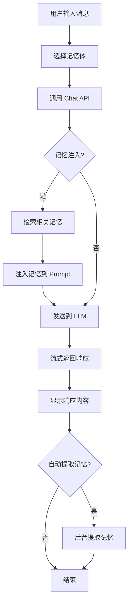
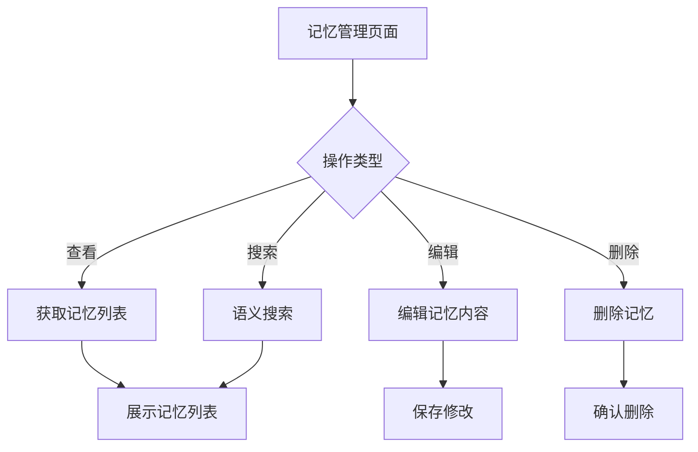

# MemPoint 前端页面规划

## 项目概述

MemPoint 前端是一个基于 Vue 3 + TypeScript + Element Plus 的单页应用，用于与 MemPoint 后端 API 进行交互，提供聊天对话、记忆体管理、记忆管理、配置管理等功能。

## 技术栈

| 技术 | 版本 | 用途 |
|------|------|------|
| Vue 3 | 3.x | 前端框架 |
| TypeScript | 5.x | 类型安全 |
| Element Plus | 2.x | UI 组件库 |
| Pinia | 2.x | 状态管理 |
| Vue Router | 4.x | 路由管理 |
| Axios | 1.x | HTTP 客户端 |
| ECharts | 5.x | 图表库（知识图谱可视化） |
| Vite | 5.x | 构建工具 |
| Markdown-it | 14.x | Markdown 渲染 |
| Highlight.js | 11.x | 代码高亮 |

## 页面结构

```
┌─────────────────────────────────────────────────────────────────┐
│                        顶部导航栏                                 │
│  [Logo]  [聊天]  [记忆体]  [记忆]  [图谱]  [配置]  [用户]       │
└─────────────────────────────────────────────────────────────────┘
├─────────────────────────────────────────────────────────────────┤
│                                                                 │
│                         主内容区域                               │
│                                                                 │
└─────────────────────────────────────────────────────────────────┘
```

## 路由规划

| 路径 | 组件 | 说明 |
|------|------|------|
| `/` | ChatView | 聊天对话页面（首页） |
| `/chat` | ChatView | 聊天对话页面 |
| `/personas` | PersonasView | 记忆体管理页面 |
| `/personas/:id` | PersonaDetailView | 记忆体详情页面 |
| `/memories` | MemoriesView | 记忆管理页面 |
| `/graph` | GraphView | 知识图谱页面 |
| `/settings` | SettingsView | 配置管理页面 |
| `/settings/:tab` | SettingsView | 配置管理页面（指定标签） |

## 页面详细规划

### 1. 聊天页面 (ChatView)

**路由**: `/` 或 `/chat`

**功能描述**: 主要的聊天对话界面，支持多轮对话、流式响应、记忆注入预览。

**页面布局**:
```
┌─────────────────────────────────────────────────────────────────┐
│  [记忆体选择▼] [新对话] [清空对话] [设置]                       │
├─────────────────────────────────────────────────────────────────┤
│                                                                 │
│  ┌───────────────────────────────────────────────────────────┐ │
│  │  对话历史区域                                              │ │
│  │  ┌─────────────────────────────────────────────────────┐   │ │
│  │  │ [用户] 你好，我是小明，我是一名软件工程师           │   │ │
│  │  └─────────────────────────────────────────────────────┘   │ │
│  │  ┌─────────────────────────────────────────────────────┐   │ │
│  │  │ [助手] 你好小明！很高兴认识你...                     │   │ │
│  │  │ [📚 已注入记忆: 小明是软件工程师]                    │   │ │
│  │  └─────────────────────────────────────────────────────┘   │ │
│  │                                                           │ │
│  └───────────────────────────────────────────────────────────┘ │
│                                                                 │
│  ┌───────────────────────────────────────────────────────────┐ │
│  │  输入区域                                                  │ │
│  │  [输入框........................................] [发送]    │ │
│  │  [🔧 记忆配置] [📝 System Prompt]                         │ │
│  └───────────────────────────────────────────────────────────┘ │
└─────────────────────────────────────────────────────────────────┘
```

**核心功能**:
- 记忆体选择器（下拉选择当前使用的记忆体）
- 对话历史列表（支持滚动、自动滚动到底部）
- 消息输入框（支持多行输入、快捷键发送）
- 发送按钮
- 流式响应显示
- 记忆注入预览（显示已注入的记忆）
- 清空对话
- Markdown 渲染
- 代码高亮
- 记忆配置面板（启用/禁用记忆、最大记忆数等）
- System Prompt 编辑器

**API 调用**:
- `GET /v1/personas` - 获取记忆体列表
- `GET /v1/models` - 获取可用模型列表
- `POST /v1/chat/completions` - 发送聊天请求（支持流式）
- `GET /v1/memories` - 获取记忆列表（用于预览）

**组件拆分**:
- `ChatHeader.vue` - 聊天页面头部（记忆体选择、新对话等）
- `ChatHistory.vue` - 对话历史列表
- `ChatMessage.vue` - 单条消息组件
- `ChatInput.vue` - 消息输入组件
- `MemoryPreview.vue` - 记忆注入预览组件
- `MemoryConfigPanel.vue` - 记忆配置面板
- `SystemPromptEditor.vue` - System Prompt 编辑器

---

### 2. 记忆体管理页面 (PersonasView)

**路由**: `/personas`

**功能描述**: 管理记忆体（Persona），包括创建、查看、编辑、删除记忆体。

**页面布局**:
```
┌─────────────────────────────────────────────────────────────────┐
│  [新建记忆体] [刷新]                                            │
├─────────────────────────────────────────────────────────────────┤
│  ┌───────────────────────────────────────────────────────────┐ │
│  │  记忆体列表                                                │ │
│  │  ┌─────────────────────────────────────────────────────┐   │ │
│  │  │ [👤 默认助手]                                        │   │ │
│  │  │    描述: 默认的通用助手                               │   │ │
│  │  │    创建时间: 2024-01-01 10:00:00                     │   │ │
│  │  │    [查看] [编辑] [删除]                              │   │ │
│  │  └─────────────────────────────────────────────────────┘   │ │
│  │  ┌─────────────────────────────────────────────────────┐   │ │
│  │  │ [👤 工作助手]                                        │   │ │
│  │  │    描述: 专门用于工作场景的助手                     │   │ │
│  │  │    创建时间: 2024-01-02 14:30:00                     │   │ │
│  │  │    [查看] [编辑] [删除]                              │   │ │
│  │  └─────────────────────────────────────────────────────┘   │ │
│  └───────────────────────────────────────────────────────────┘ │
└─────────────────────────────────────────────────────────────────┘
```

**核心功能**:
- 记忆体列表展示（卡片或列表形式）
- 创建新记忆体（对话框）
- 查看记忆体详情
- 编辑记忆体信息
- 删除记忆体（带确认）
- 记忆体搜索/过滤

**API 调用**:
- `GET /v1/personas` - 获取记忆体列表
- `POST /v1/personas` - 创建新记忆体
- `GET /v1/personas/{id}` - 获取记忆体详情
- `PUT /v1/personas/{id}` - 更新记忆体
- `DELETE /v1/personas/{id}` - 删除记忆体

**组件拆分**:
- `PersonaList.vue` - 记忆体列表
- `PersonaCard.vue` - 记忆体卡片
- `PersonaForm.vue` - 记忆体表单（新建/编辑）
- `PersonaDeleteDialog.vue` - 删除确认对话框

---

### 3. 记忆体详情页面 (PersonaDetailView)

**路由**: `/personas/:id`

**功能描述**: 查看和编辑单个记忆体的详细信息，包括基本信息、System Prompt、关联的记忆等。

**页面布局**:
```
┌─────────────────────────────────────────────────────────────────┐
│  [← 返回列表] [保存] [取消]                                      │
├─────────────────────────────────────────────────────────────────┤
│  ┌───────────────────────────────────────────────────────────┐ │
│  │  基本信息                                                  │ │
│  │  ID: persona-1                                            │ │
│  │  名称: [默认助手........................................]   │ │
│  │  描述: [默认的通用助手.................................]   │ │
│  └───────────────────────────────────────────────────────────┘ │
│  ┌───────────────────────────────────────────────────────────┐ │
│  │  System Prompt                                            │ │
│  │  ┌─────────────────────────────────────────────────────┐   │ │
│  │  │ 你是一个智能助手，能够帮助用户解决问题...            │   │ │
│  │  │                                                     │   │ │
│  │  └─────────────────────────────────────────────────────┘   │ │
│  └───────────────────────────────────────────────────────────┘ │
│  ┌───────────────────────────────────────────────────────────┐ │
│  │  关联记忆 (5条)                                          │ │
│  │  ┌─────────────────────────────────────────────────────┐   │ │
│  │  │ • 用户喜欢喝红茶 (2024-01-01)                         │   │ │
│  │  │ • 用户是软件工程师 (2024-01-01)                      │   │ │
│  │  │ • [查看更多]                                         │   │ │
│  │  └─────────────────────────────────────────────────────┘   │ │
│  └───────────────────────────────────────────────────────────┘ │
└─────────────────────────────────────────────────────────────────┘
```

**核心功能**:
- 记忆体基本信息编辑（名称、描述）
- System Prompt 编辑器（支持语法高亮）
- 关联记忆列表展示
- 记忆统计信息（记忆数量、最后更新时间等）

**API 调用**:
- `GET /v1/personas/{id}` - 获取记忆体详情
- `PUT /v1/personas/{id}` - 更新记忆体
- `GET /v1/memories?persona_id={id}` - 获取关联记忆

**组件拆分**:
- `PersonaBasicInfo.vue` - 基本信息编辑
- `SystemPromptEditor.vue` - System Prompt 编辑器
- `PersonaMemories.vue` - 关联记忆列表

---

### 4. 记忆管理页面 (MemoriesView)

**路由**: `/memories`

**功能描述**: 管理所有记忆，包括浏览、搜索、编辑、删除记忆。

**页面布局**:
```
┌─────────────────────────────────────────────────────────────────┐
│  [搜索框................] [记忆体▼] [类型▼] [刷新]              │
├─────────────────────────────────────────────────────────────────┤
│  ┌───────────────────────────────────────────────────────────┐ │
│  │  记忆列表 (共 25 条)                                      │ │
│  │  ┌─────────────────────────────────────────────────────┐   │ │
│  │  │ [📝] 用户喜欢喝红茶                                  │   │ │
│  │  │     类型: 长期记忆 | 记忆体: 默认助手                │   │ │
│  │  │     评分: 8.5 | 访问次数: 3                         │   │ │
│  │  │     创建时间: 2024-01-01 10:00:00                   │   │ │
│  │  │     [查看] [编辑] [删除]                            │   │ │
│  │  └─────────────────────────────────────────────────────┘   │ │
│  │  ┌─────────────────────────────────────────────────────┐   │ │
│  │  │ [📝] 用户是软件工程师                                │   │ │
│  │  │     类型: 长期记忆 | 记忆体: 默认助手                │   │ │
│  │  │     评分: 9.2 | 访问次数: 5                         │   │ │
│  │  │     创建时间: 2024-01-01 10:05:00                   │   │ │
│  │  │     [查看] [编辑] [删除]                            │   │ │
│  │  └─────────────────────────────────────────────────────┘   │ │
│  └───────────────────────────────────────────────────────────┘ │
│  [上一页] 1 2 3 [下一页]                                      │
└─────────────────────────────────────────────────────────────────┘
```

**核心功能**:
- 记忆列表展示（支持分页）
- 记忆搜索（语义搜索）
- 记忆过滤（按记忆体、类型）
- 查看记忆详情
- 编辑记忆内容
- 删除记忆（带确认）
- 批量操作（批量删除）

**API 调用**:
- `GET /v1/memories` - 获取记忆列表
- `GET /v1/memories/{id}` - 获取记忆详情
- `PUT /v1/memories/{id}` - 更新记忆
- `DELETE /v1/memories/{id}` - 删除记忆
- `POST /v1/memories/search` - 语义搜索记忆

**组件拆分**:
- `MemoryFilter.vue` - 记忆过滤器
- `MemoryList.vue` - 记忆列表
- `MemoryCard.vue` - 记忆卡片
- `MemoryDetail.vue` - 记忆详情
- `MemoryForm.vue` - 记忆表单（编辑）
- `MemorySearch.vue` - 记忆搜索组件

---

### 5. 知识图谱页面 (GraphView)

**路由**: `/graph`

**功能描述**: 可视化展示知识图谱，包括实体节点、关系边，支持交互式浏览。

**页面布局**:
```
┌─────────────────────────────────────────────────────────────────┐
│  [搜索实体................] [刷新] [导出]                        │
├─────────────────────────────────────────────────────────────────┤
│  ┌───────────────────────────────────────────────────────────┐ │
│  │                                                           │ │
│  │                    知识图谱可视化                           │ │
│  │                                                           │ │
│  │              [小明] ────── [软件工程师]                    │ │
│  │                  │                                           │ │
│  │                  │ 喜欢喝                                    │ │
│  │                  ▼                                           │ │
│  │              [红茶] ────── [饮品]                           │ │
│  │                                                           │ │
│  └───────────────────────────────────────────────────────────┘ │
│  ┌───────────────────────────────────────────────────────────┐ │
│  │  实体详情                                                  │ │
│  │  名称: 小明                                                │ │
│  │  类型: User                                                │ │
│  │  描述: 用户实体                                            │ │
│  │  关联关系: 3条                                             │ │ │
│  └───────────────────────────────────────────────────────────┘ │
└─────────────────────────────────────────────────────────────────┘
```

**核心功能**:
- 知识图谱可视化（使用 ECharts Graph）
- 实体节点展示
- 关系边展示
- 节点交互（点击查看详情、拖拽移动）
- 图谱缩放、平移
- 实体搜索（高亮匹配节点）
- 图谱导出（图片、JSON）
- 图谱过滤（按类型）

**API 调用**:
- `GET /v1/memories` - 获取记忆数据
- 需要后端提供图谱数据接口（待实现）

**组件拆分**:
- `GraphVisualization.vue` - 图谱可视化组件
- `GraphControls.vue` - 图谱控制面板
- `EntityDetail.vue` - 实体详情面板
- `GraphSearch.vue` - 实体搜索组件

---

### 6. 配置管理页面 (SettingsView)

**路由**: `/settings`

**功能描述**: 管理系统配置，包括 LLM 配置、Embedding 配置、记忆系统配置等。

**页面布局**:
```
┌─────────────────────────────────────────────────────────────────┐
│  [LLM配置] [Embedding配置] [记忆系统] [记忆评分] [数据库]        │
├─────────────────────────────────────────────────────────────────┤
│  ┌───────────────────────────────────────────────────────────┐ │
│  │  LLM 配置                                                 │ │
│  │  Base URL: [https://api.siliconflow.com/v1................]│ │
│  │  API Key: [••••••••••••••••••••••••••••••••••••••] [显示]   │ │
│  │  Model: [deepseek-ai/DeepSeek-V3.2▼......................]│ │
│  │  Timeout: [60] 秒                                          │ │
│  │  [保存] [重置为默认]                                       │ │
│  └───────────────────────────────────────────────────────────┘ │
└─────────────────────────────────────────────────────────────────┘
```

**标签页**:
1. **LLM 配置** - LLM API 配置
2. **Embedding 配置** - Embedding API 配置
3. **记忆系统** - 记忆系统配置
4. **记忆评分** - 记忆评分权重配置
5. **数据库** - Milvus、KùzuDB 配置

**核心功能**:
- 配置项展示和编辑
- 配置保存和重置
- 配置验证
- 配置导入导出

**API 调用**:
- `GET /v1/config` - 获取系统配置
- `PUT /v1/config` - 更新系统配置
- `GET /v1/config/{config_key}` - 获取指定配置
- `PUT /v1/config/{config_key}` - 更新指定配置
- `POST /v1/config/reinitialize` - 重新初始化配置

**组件拆分**:
- `SettingsTabs.vue` - 配置标签导航
- `LLMConfig.vue` - LLM 配置表单
- `EmbeddingConfig.vue` - Embedding 配置表单
- `MemorySystemConfig.vue` - 记忆系统配置表单
- `MemoryScoringConfig.vue` - 记忆评分配置表单
- `DatabaseConfig.vue` - 数据库配置表单

---

## 状态管理 (Pinia)

### Stores

| Store | 用途 |
|-------|------|
| `useChatStore` | 聊天状态管理（消息列表、当前记忆体等） |
| `usePersonaStore` | 记忆体状态管理 |
| `useMemoryStore` | 记忆状态管理 |
| `useConfigStore` | 配置状态管理 |
| `useGraphStore` | 知识图谱状态管理 |
| `useAuthStore` | 认证状态管理（API Key） |

### useChatStore 示例

```typescript
interface ChatState {
  currentPersonaId: string
  currentModel: string
  messages: ChatMessage[]
  isStreaming: boolean
  memoryConfig: MemoryConfig
}
```

---

## API 服务层

### API 模块结构

```
src/api/
├── index.ts           # API 客户端初始化
├── chat.ts            # 聊天相关 API
├── persona.ts         # 记忆体相关 API
├── memory.ts          # 记忆相关 API
├── config.ts          # 配置相关 API
├── models.ts          # 模型相关 API
└── graph.ts           # 图谱相关 API
```

### API 调用示例

```typescript
// src/api/chat.ts
import request from './index'

export const chatAPI = {
  // 发送聊天请求（流式）
  sendMessage(data: ChatCompletionRequest) {
    return request.post('/v1/chat/completions', data, {
      responseType: 'stream'
    })
  }
}

// src/api/persona.ts
export const personaAPI = {
  // 获取记忆体列表
  list() {
    return request.get('/v1/personas')
  },
  // 创建记忆体
  create(data: PersonaCreate) {
    return request.post('/v1/personas', data)
  },
  // 获取记忆体详情
  get(id: string) {
    return request.get(`/v1/personas/${id}`)
  },
  // 更新记忆体
  update(id: string, data: PersonaUpdate) {
    return request.put(`/v1/personas/${id}`, data)
  },
  // 删除记忆体
  delete(id: string) {
    return request.delete(`/v1/personas/${id}`)
  }
}

// src/api/memory.ts
export const memoryAPI = {
  // 获取记忆列表
  list(params?: { persona_id?: string; type?: string; limit?: number }) {
    return request.get('/v1/memories', { params })
  },
  // 获取记忆详情
  get(id: string) {
    return request.get(`/v1/memories/${id}`)
  },
  // 更新记忆
  update(id: string, data: MemoryUpdate) {
    return request.put(`/v1/memories/${id}`, data)
  },
  // 删除记忆
  delete(id: string) {
    return request.delete(`/v1/memories/${id}`)
  },
  // 语义搜索记忆
  search(data: MemorySearchRequest) {
    return request.post('/v1/memories/search', data)
  }
}

// src/api/config.ts
export const configAPI = {
  // 获取系统配置
  get() {
    return request.get('/v1/config')
  },
  // 更新系统配置
  update(data: SystemConfigUpdate) {
    return request.put('/v1/config', data)
  },
  // 获取指定配置
  getByKey(config_key: string) {
    return request.get(`/v1/config/${config_key}`)
  },
  // 更新指定配置
  updateByKey(config_key: string, data: any) {
    return request.put(`/v1/config/${config_key}`, data)
  },
  // 重新初始化配置
  reinitialize() {
    return request.post('/v1/config/reinitialize')
  }
}

// src/api/models.ts
export const modelsAPI = {
  // 列出模型
  list() {
    return request.get('/v1/models')
  }
}
```

---

## 项目目录结构

```
frontend/
├── public/                 # 静态资源
├── src/
│   ├── assets/            # 资源文件
│   ├── api/               # API 服务层
│   │   ├── index.ts
│   │   ├── chat.ts
│   │   ├── persona.ts
│   │   ├── memory.ts
│   │   ├── config.ts
│   │   ├── models.ts
│   │   └── graph.ts
│   ├── components/        # 公共组件
│   │   ├── common/        # 通用组件
│   │   ├── chat/          # 聊天相关组件
│   │   ├── persona/       # 记忆体相关组件
│   │   ├── memory/        # 记忆相关组件
│   │   └── graph/         # 图谱相关组件
│   ├── composables/       # 组合式函数
│   ├── layouts/           # 布局组件
│   │   ├── DefaultLayout.vue
│   │   └── EmptyLayout.vue
│   ├── router/            # 路由配置
│   │   └── index.ts
│   ├── stores/            # Pinia 状态管理
│   │   ├── chat.ts
│   │   ├── persona.ts
│   │   ├── memory.ts
│   │   ├── config.ts
│   │   ├── graph.ts
│   │   └── auth.ts
│   ├── types/             # TypeScript 类型定义
│   │   ├── chat.ts
│   │   ├── persona.ts
│   │   ├── memory.ts
│   │   ├── config.ts
│   │   ├── models.ts
│   │   └── index.ts
│   ├── utils/             # 工具函数
│   │   ├── request.ts     # Axios 封装
│   │   ├── storage.ts     # 本地存储
│   │   └── helpers.ts
│   ├── views/             # 页面组件
│   │   ├── ChatView.vue
│   │   ├── PersonasView.vue
│   │   ├── PersonaDetailView.vue
│   │   ├── MemoriesView.vue
│   │   ├── GraphView.vue
│   │   └── SettingsView.vue
│   ├── App.vue            # 根组件
│   └── main.ts            # 入口文件
├── .env.development       # 开发环境变量
├── .env.production        # 生产环境变量
├── index.html             # HTML 模板
├── package.json
├── tsconfig.json
├── vite.config.ts
└── README.md
```

---

## 核心功能流程图

### 聊天流程



### 记忆管理流程



---

## 设计规范

### 颜色主题

| 颜色 | 用途 | 十六进制 |
|------|------|----------|
| 主色 | 主要按钮、链接 | `#409EFF` |
| 成功 | 成功提示 | `#67C23A` |
| 警告 | 警告提示 | `#E6A23C` |
| 危险 | 删除、错误 | `#F56C6C` |
| 信息 | 信息提示 | `#909399` |
| 背景 | 页面背景 | `#F5F7FA` |
| 卡片背景 | 卡片背景 | `#FFFFFF` |

### 响应式断点

| 断点 | 屏幕宽度 |
|------|----------|
| xs | < 768px |
| sm | ≥ 768px |
| md | ≥ 992px |
| lg | ≥ 1200px |
| xl | ≥ 1920px |

---

## 开发优先级

### 第一阶段 (MVP)
- [ ] 聊天页面基础功能
- [ ] 记忆体管理页面
- [ ] 记忆管理页面
- [ ] 配置管理页面基础功能

### 第二阶段
- [ ] 知识图谱可视化
- [ ] 记忆搜索功能
- [ ] 流式响应优化

### 第三阶段
- [ ] 记忆导入导出
- [ ] 高级配置选项
- [ ] 主题切换功能
